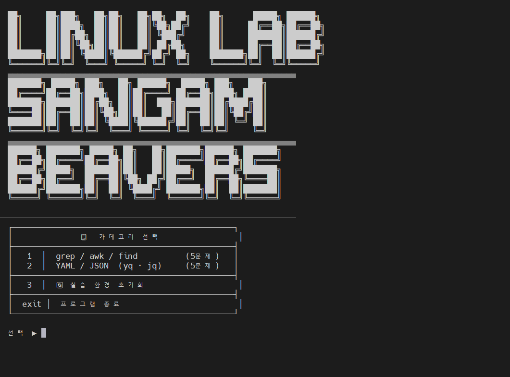
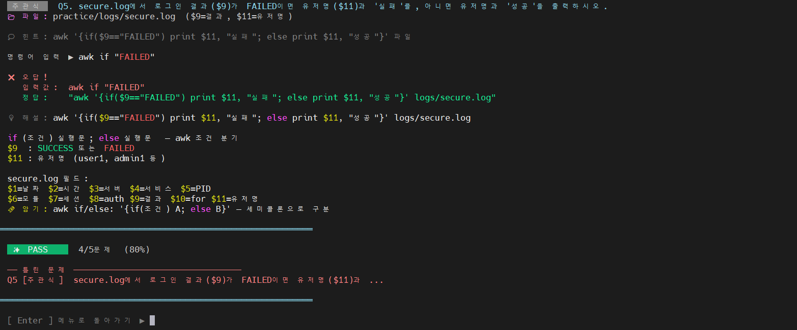

# 🐧 리눅스 실무 트레이닝 툴
Linux 명령어 실습 퀴즈 CLI 프로그램

<br>

## 📌 Overview
신입사원이 리눅스 환경에서 자주 사용하는 `find`, `grep`, `awk` 명령어를 실제 로그/데이터 파일을 기반으로 학습할 수 있도록 구성된 실습 자료





<br>


## 🧑‍💻 팀원 소개


|  |  |  |%7C%7C
|:---:|:---:|:---:|:---:|:---:|
| **심규보**<br>[@Qbooo](https://github.com/Qbooo) | **최승민**<br>[@Kumin-91](https://github.com/Kumin-91) | **이유진**<br>[@janie71](https://github.com/janie71) | **유예원**<br>[@Yewon0106](https://github.com/Yewon0106) | **서주영**<br>[@youngz1](https://github.com/young2z1) |

<br/>

## 🗂️ Scenario

사내 서버 환경에서 로그와 데이터 파일이 여러 디렉토리에 분산되어 있으며, 신입사원은 해당 파일들을 직접 탐색하고 분석하며 문제를 해결해야 합니다.

- `logs/` : 웹 접속 로그, 시스템 에러 로그, 로그인 기록
- `data/` : 사원 정보, 서버 자산 정보

<br>

## 🎯 Goal

- 파일 탐색 (`find`)
- 로그 검색 (`grep`)
- 데이터 가공 (`awk`)

위 3가지 핵심 명령어를 활용하여

실제 운영 환경과 유사한 상황에서 로그를 분석하는 능력을 기르는 것이 목적입니다.

<br>

## 🛠️ What We Built

- 실무 기반 로그/데이터 파일 구성
- 단계별 문제 (객관식 + 주관식)
- 명령어 중심 문제 풀이 및 해설

<br>

## 📁 Directory

디렉토리 구조는 다음과 같습니다.

```jsx
/home/fisa/training/
├── logs/
│   ├── access.log          # 웹 서버 접속 기록 (IP, 시간, 요청경로 등)
│   ├── error_202603.log    # 3월 시스템 에러 로그 (날짜, 에러등급, 메시지)
│   └── secure.log          # 로그인 시도 기록 (ID, 성공여부, IP)
└── data/
    ├── user_list.csv       # 사원 명단 (사번, 이름, 부서, 직급)
       └── server_info.tsv     # 서버 자산 정보 (탭 구분: 서버명, IP, 위치)
```

<br>

## 📋 카테고리

| 번호 | 주제 | 문제 수 | 형식 |
|------|------|---------|------|
| 1 | grep / awk / find | 5문제 | 객관식 2 + 주관식 3 |
| 2 | YAML / JSON (yq · jq) | 5문제 | 객관식 1 + 주관식 4 |
| 3 | 환경 초기화 | - | practice / 복원 |

<br>

## ⚙️ 설치

```bash
git clone https://github.com/yourname/linux-lab.git
cd linux-lab
chmod +x install.sh
sudo ./install.sh

# 실행
linux-lab

# 또는 설치 없이
python3 quiz.py
```

**요구사항**: Python 3.7+  |  외부 라이브러리 없음


<br>

## 💡grep / awk / find 문제
### 1. grep 옵션 조합으로 다중 패턴 대소문자 무시 검색
**문제 1:** `error_202603.log`에서 `ERROR` 또는 `WARN`을 대소문자 구분 없이 찾기

다음 중 올바른 명령어는 무엇인가?

1. `grep -E "ERROR|WARN" error_202603.log`
2. `grep -i "ERROR|WARN" error_202603.log`
3. `grep -i -E "ERROR|WARN" error_202603.log`
4. `grep -v "ERROR|WARN" error_202603.log`

**답:** 3

 `grep -i -E "ERROR|WARN" error_202603.log`


#### 해설

- `ERROR|WARN`처럼 OR 조건을 사용하려면 `-E` 옵션 필요
- 대소문자를 구분하지 않으려면 `-i` 옵션이 필요


---


### 2. awk 조건식으로 특정 상태코드 행 필터링
**문제 2:** `access.log`에서 상태코드가 `500`인 행만 출력

다음 중 올바른 `awk` 명령어는 무엇인가?

1. `awk '$4 = 500 {print}' access.log`
2. `awk '$4 == 500 {print}' access.log`
3. `awk '$4 != 500 {print}' access.log`
4. `awk '{if $4 == 500}' access.log`


**답:** 2
 
`awk '$4 == 500 {print}' access.log`


#### 해설

- `$4` → 4번째 필드(상태코드)
- `==` → 비교 연산자
- `{print}` → 조건을 만족하는 행 전체 출력


---

### 3. find와 grep을 활용한 로그 파일 검색
**문제 3:** 현재 디렉터리 아래에서 .log 파일만 찾아, 그 안에 timeout 문자열이 포함된 줄을 검색하시오.

**답:** `find . -name "*.log" -exec grep 'timeout' {} \;`

#### 해설
* **전체 파일 탐색**
  `find .`
  -> 현재 디렉터리 아래의 모든 파일/디렉터리 탐색
* **.log 파일만 필터링**
  `find . -name "*.log"`
  -> 로그 파일만 대상으로 좁힘
* **찾은 파일마다 grep 실행**
  `find . -name "*.log" -exec grep 'timeout' {} \;`

---

### 4. awk로 access.log에서 조건에 맞는 컬럼 추출
**문제 4:** access.log에서 요청 방식이 POST인 줄의 IP 주소와 요청 경로를 출력하시오.

**답:** `awk '$6=="POST" {print $1, $7}' logs/access.log`

#### 해설
* **파일 구조 먼저 확인**
  `cat logs/access.log`
  -> 로그는 “공백 기준 컬럼 구조”
* **특정 컬럼 출력 연습**
  `awk '{print $1}' logs/access.log`
  -> 첫 번째 컬럼(IP) 출력
* **여러 컬럼 출력**
  `awk '{print $1, $7}' logs/access.log`
  -> IP + 요청 경로 출력
* **POST 요청만 필터링**
  `awk '$6=="POST" {print $1, $7}' logs/access.log`

---

### 5번. awk if-else로 로그인 결과 가공 출력
**문제 5:** secure.log에서 로그인 결과가 FAILED이면 사용자명과 "실패"를, 아니면 사용자명과 "성공"을 출력하시오.

**답:** `awk '{if($9=="FAILED") print $11, "실패"; else print $11, "성공"}' logs/secure.log`

#### 해설
* **기본 출력 확인**
  `awk '{print $0}' logs/secure.log`
  -> 전체 데이터 구조 확인
* **사용자명만 출력**
  `awk '{print $11}' logs/secure.log`
* **조건 없이 텍스트 붙이기**
  `awk '{print $11, "결과"}' logs/secure.log`
* **FAILED 조건 처리 (if)**
  `awk '{if($9=="FAILED") print $11, "실패"}' logs/secure.log`
  -> FAILED인 경우만 출력됨
* **성공/실패 모두 출력 (if-else 완성)**
  `awk '{if($9=="FAILED") print $11, "실패"; else print $11, "성공"}' logs/secure.log`


<br>

## 💡  YAML / JSON (yq · jq) 문제

### 1번: YAML 파일 유효성 검증 및 오류 수정

**문제 1:**  의도적으로 오류가 포함된 YAML 파일 `/data/docker-compose.yml`이다. 오류 메시지를 확인하고, 오류를 직접 수정한 뒤 다시 검증하라.

**답:**
    ```bash
    yq -y '.' /data/docker-compose.yml
    ```

#### 해설

* **에러 분석**: 에러 메시지의 "line 15, column 6"은 오류가 감지된 위치입니다. 실제 원인은 YAML의 블록 매핑 문법을 파싱할 때 line 4에서 시작된 구조에서 예상한 키가 line 15에서 발견되지 않았다는 의미입니다. 이는 보통 들여쓰기가 규칙과 맞지 않을 때 발생합니다.

* **수정 방법**: 

    1. 15번째 줄 근처의 들여쓰기를 확인합니다 (YAML은 스페이스 또는 탭 혼용 금지)

    2. line 4-15 사이의 들여쓰기 일관성을 검토합니다

    3. 수정 후 다시 검증합니다


### 2번: 키 값 수정 후 다른 파일로 저장

**문제 2:** `nc_server` 서비스의 포트를 `4432:443` → `8443:443` 으로 변경하라. 결과를 `/data/custom.yml`로 저장하라.

**답:**
    ```bash
    yq -y '.services.nc_server.ports = ["8443:443"]' /data/docker-compose.yml > /data/custom.yml
    ```

#### 해설
* 할당 연산자 `=`를 사용하여 ports 값을 배열 형식 `["8443:443"]`으로 변경합니다. 원본 파일은 수정되지 않고, 결과를 리다이렉트(>)로 새 파일에 저장합니다.


### 3번: YAML → JSON 변환

**문제 3:**

* `/data/docker-compose.yml` 전체를 JSON 형식으로 변환해야 한다. 변환된 JSON을 `/data/docker-compose.json` 파일로 저장하라.

**답:**
    ```bash
    yq '.' /data/docker-compose.yml > /data/docker-compose.json
    ```

#### 해설
* `-y` 옵션 없이 기본 출력 형식(JSON)으로 변환하고, 결과를 docker-compose.json 파일로 저장합니다. yq는 기본적으로 JSON으로 출력하기 때문에 이를 파일로 저장하면 JSON 형식의 파일이 됩니다.


### 4번: YAML 특정 환경변수 항목 삭제

**문제 4:**

* `/data/docker-compose.json` 파일의 `nc_mariadb` 서비스에는 아래와 같은 환경변수들이 정의되어 있다.

    ```
    environment:
    - PUID=${OPR_UID}
    - PGID=${OPR_GID}
    - TZ=UTC
    - MYSQL_ROOT_PASSWORD=${MYSQL_ROOT_PASSWORD}
    - MYSQL_DATABASE=${DB_NAME}
    - MYSQL_USER=${DB_USER}
    - MYSQL_PASSWORD=${DB_PASSWORD}
    ```

* 보안 정책에 따라 `MYSQL_ROOT_PASSWORD` 항목을 환경변수 목록에서 제거하시오.

**답:**
    ```bash
    jq 'del(.services.nc_mariadb.environment[3])' /data/docker-compose.json > /data/tmp.json
    mv /data/tmp.json /data/docker-compose.json
    ```

#### 해설
* `del()` 함수를 사용하여 `MYSQL_ROOT_PASSWORD` 항목이 포함된 배열 요소를 삭제합니다. 배열 요소는 0부터 시작하는 인덱스로 접근하므로, `MYSQL_ROOT_PASSWORD`가 4번째 요소라면 인덱스는 3입니다. 결과를 임시 파일로 저장한 후 원본 파일로 덮어씁니다.


### 5번: JSON 배열에 환경변수 항목 추가

**문제 5:**

* `/data/docker-compose.json` 파일의 `nc_redis` 서비스의 `environment` 배열에 `- UMASK=022` 항목을 추가하려고 한다. 올바른 명령어를 고르시오.

    1. `jq 'del(.services.nc_redis.environment[] | "UMASK=022")' /data/docker-compose.json` 

    2. `jq 'add(.services.nc_redis.environment, "UMASK=022")' /data/docker-compose.json`

    3. `jq '.services.nc_redis.environment += ["UMASK=022"]' /data/docker-compose.json`

    4. `jq '.services.nc_redis.environment[4] | "UMASK=022"' /data/docker-compose.json`

**답:**
3

`jq '.services.nc_redis.environment += ["UMASK=022"]' /data/docker-compose.json`

#### 해설
| 보기 | 설명 | 평가 |
| --- | --- | --- |
| 1. | `del()`은 배열 요소를 **삭제**하는 함수로, 추가와는 관계 없음 | ❌ |
| 2. | `add()`는 jq/yq에서 **배열 병합** 등에 사용되는 함수이지만, 단순 요소 추가에는 부적합 | ❌ |
| 3. | `+=` 연산자는 배열에 새 요소를 **올바르게 추가**하는 방법 | ✅ **정답** |
| 4. | `\|` 파이프는 필터를 연결하여 데이터를 변환할 뿐, 배열 추가 기능 없음 | ❌ |

<br>


